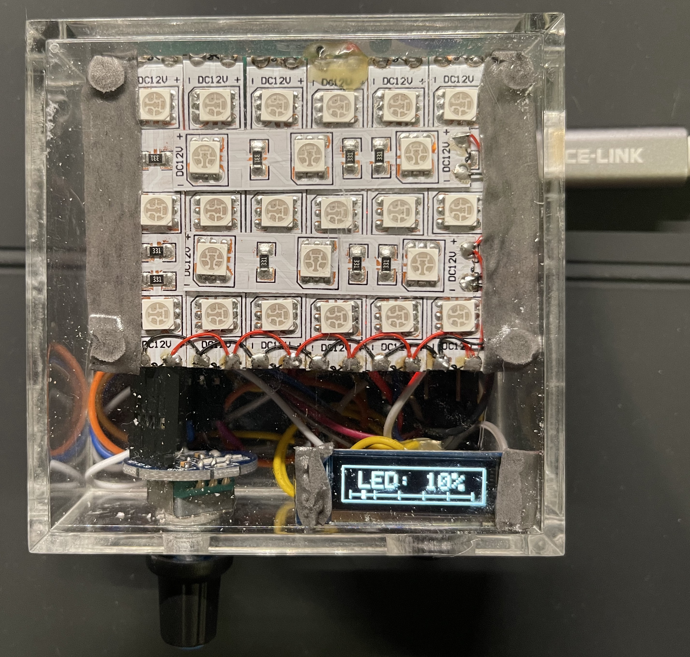

# LED light box

## Introduction
A DIY red LED light box with an OLED display.

The OLED display shows the current LED brightness in percentage from 0% t0 100%.

The brightness meter bar at the bottom provides a more convenient way to visualize the current brightness level.

The boundary of the OLED display shows the ON/OFF status of the upper red LED board.

## Usages
Button Actions:

    Rotate: Adjust the red LED brightness.

    Press: Toggle the red LED.

    Long press: Reset to 50% brightness.

    Double press: :)
